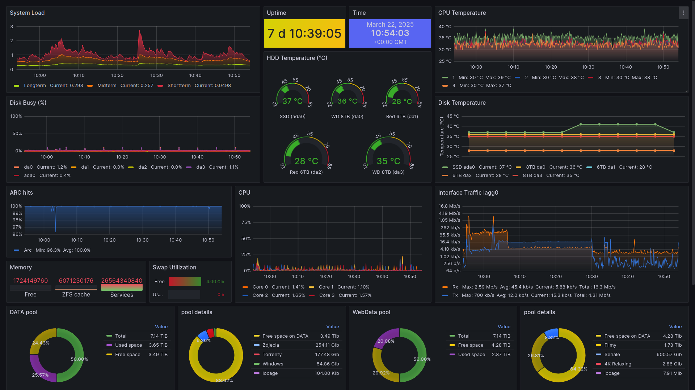

# TrueNAS_Grafana_Dashboard
Customized Grafana dashboard with influxDB for TrueNAS inside iocage.

## Installation
Installation based on this great tutorial [cucac/truenas-influxdb-grafana](https://github.com/cucac/truenas-influxdb-grafana/tree/master)

## Installed plugins:
Except core plugins I have this two additional:
```bash
grafana-clock-panel @ 2.1.8
marcusolsson-calendar-panel @ 2.5.0
```

## Screenshot:
This is full screen - kiosk mode dashboard, as I have this accesible on my tablets :)


