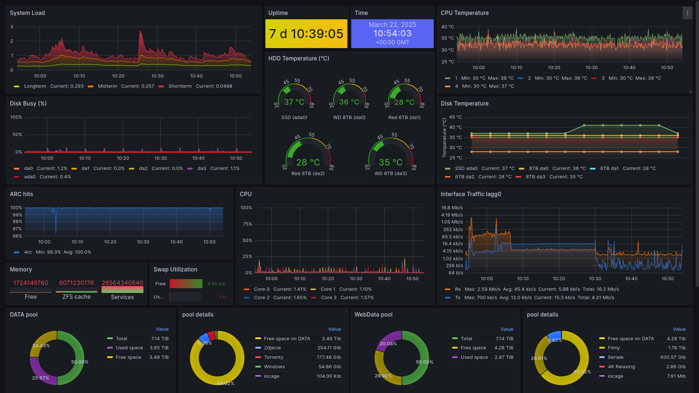
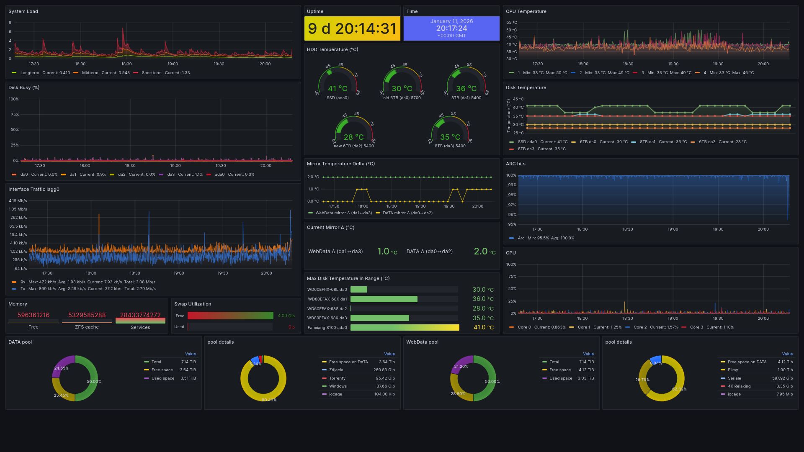

# TrueNAS_Grafana_Dashboard
Customized Grafana dashboard with influxDB for TrueNAS inside iocage.

## Installation
Installation based on this great tutorial [cucac/truenas-influxdb-grafana](https://github.com/cucac/truenas-influxdb-grafana/tree/master)

## Installed plugins:
Except core plugins I have this two additional:
```bash
grafana-clock-panel @ 2.1.8
marcusolsson-calendar-panel @ 2.5.0
```

## Screenshots:
This is full screen - kiosk mode dashboard v.0.1, as I have this accesible on my tablets :)



# New version v.0.2- work in progress:


## TrueNAS CORE – Disk Thermals & Mirror Health (Advanced)

A Grafana dashboard designed for **TrueNAS CORE 13.x** systems with a focus on **disk thermals, ZFS mirror health, and early failure detection**.

This dashboard provides real-time and historical visibility into how storage devices behave under real workloads, helping detect airflow issues, thermal imbalance, and long-term degradation **before SMART or ZFS errors appear**.

---

## Key Features

- Per-disk **HDD / SSD temperature monitoring** with visual thresholds  
- **Mirror Temperature Delta (Δ)** tracking to detect imbalance between mirror pairs  
- **Current mirror Δ** displayed numerically for instant health assessment  
- **Maximum disk temperature in selected time range** to catch short-lived overheating events  
- Disk activity, ARC hit ratio, memory usage, CPU load, and network traffic for full system context  

---

## Why This Dashboard Exists

In compact servers and home-lab NAS systems, disk placement, controller heat, and mixed RPM drives can cause uneven thermal stress.  
ZFS mirrors tolerate failures — but **thermals often signal problems long before failures happen**.

This dashboard helps you:
- Optimize drive placement
- Validate cooling changes
- Decide when a disk is becoming a thermal outlier
- Monitor mirror symmetry over time

---

## Designed For

- TrueNAS CORE 13.x
- ZFS mirror pools
- Home-lab and prosumer NAS setups
- Small-form-factor servers (e.g. MicroServer-class systems)

---

## Requirements

- Grafana
- TrueNAS CORE metrics (Prometheus / Telegraf / node exporter setup)
- No external Grafana plugins required

---

## Notes

- Disk names (`da0`, `da1`, etc.) and pool mappings are customizable
- Dashboard is safe to modify and extend
- Import-ready JSON with unique UID

---

## License

MIT / Public use — customize freely.
